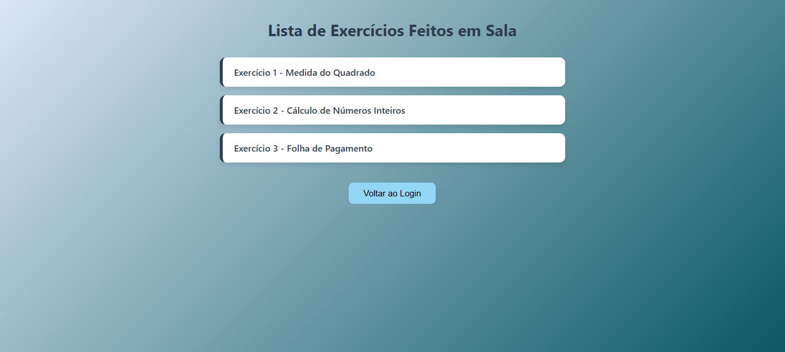
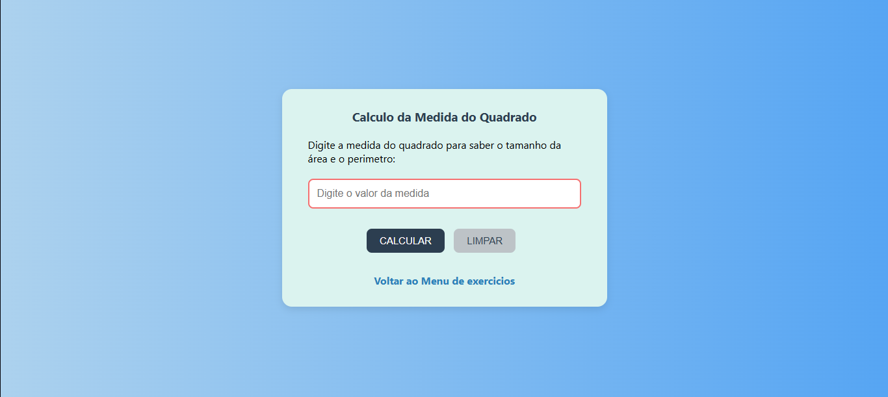
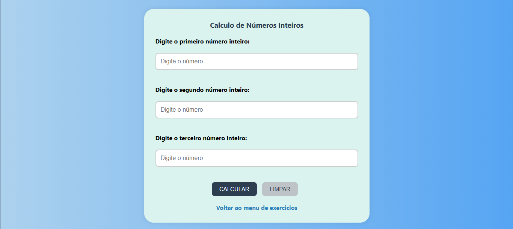

<h1 align="center">
Projetos de Lógica de Programação   (Prof. Humberto)
</h1>

  

Projetos simples desenvolvidos durante o curso de Lógica de Programação ministrado pelo Prof. Humberto. 

🔗 
<a href="https://ismaelmoura.vercel.app/assets/Projetos_DoisBerto/Lista_exercicios.html" target="_blank"><b>Acesse a lista de exercícios</b></a> 

<h3> 🛠️ Tecnologias utilizadas </h3>

<table align="center">
<tr>
  <td align="center">
     
    
HTML5

  </td>
  
  <td align="center">
    
    
CSS3

  </td>
  
  <td align="center">
    
    
JavaScript

    </td>
    </tr>
  </table>

<h2 align="center"> 🎯 Objetivo do Projeto </h2>

O objetivo deste projeto é praticar e aprimorar as habilidades de lógica de programação por meio da implementação de soluções para uma série de exercícios propostos em sala pelo Prof. Humberto na ETEC Sapopemba. Cada exercício visa desenvolver o raciocínio lógico, a capacidade de resolver problemas e a familiaridade com conceitos fundamentais de programação.

O foco principal foi aprender e aprimorar os conhecimentos em JavaScript, aplicando-os em situações práticas e atribuir a função de interatividade às páginas HTML, tornando-as mais dinâmicas e claras às ações do usuário.

Além disso, o projeto também proporcionou a oportunidade de explorar a estruturação e estilização de páginas web utilizando HTML e CSS, garantindo que as soluções não apenas funcionem corretamente, mas também sejam apresentadas de maneira responsiva e atraente.

<h2 align="center"> 📚 Exercícios Resolvidos </h2>

<ul>
<b>
  <li> 📌 Exercicio 01: Calculo da Medida do Quadrado</li>  
</b>
  

    Descrição do exercicio:   
    <b>Entrar como uma entrada de medida do quadrado e exibir a área e perimetro do mesmo; </b>
  

  
  

  <strong>Link do arquivo:</strong> <a href="./Exercicio%201%20-%20Javascript%20%28Medida%20do%20Quadrado%29.html" target="_blank"> 🔗 Exercicio 01 - Javascript (Medida do Quadrado).html</a>

   
<b>
  <li> 📌 Exercicio 02: Calculo de Números Inteiros</li> 
 </b>

  

     Descrição do exercicio:   
    <b>Entrar com três números inteiros quaisquer e exibir o maior número entre eles;</b>
  

  
  
  <strong>Link do arquivo:</strong> <a href="./Exercicio%202%20-%20Javascript%20%28Numeros%20Inteiros%29.html" target="_blank"> 🔗 Exercicio 02 - Javascript (Calculo de Números Inteiros).html</a>
  
   

<b>
  <li> 📌 Exercicio 03: Folha de Pagamento</li> 
 </b>

  

     Descrição do exercicio:   
    <b>
    Calcular a folha de pagamento do fúncionário, como segue:

Entrada de Dados:

1-Quantidade de Salários Minimos; Referência do Salário Mínimo: R$: 1518,00

Saida de Dados;

1-Salário Bruto;
2-INSS (Descontar 11% de aliquota de imposto, caso salário bruto superior à R$ 1850,00; caso contrário, haverá isenção.)
3-Salário Liquido;
</b>
  

  
  
  
  <strong>Link do arquivo:</strong> <a href="./Exercicio%203%20-%20Javascript%20%28Folha%20de%20Pagamento%29.html" target="_blank"> 🔗 Exercicio 03 - Javascript (Folha de Pagamento).html</a>
  
   

<b>
  <li> 📌 Exercicio 04: Página de Login</li> 
 </b>

  

     Descrição do exercicio:   
    <b>
    Criar uma página de login simples com HTML, CSS e JavaScript. A página deve conter campos para o usuário inserir seu nome de usuário e senha, além de um botão de login. Não é necessário implementar autenticação real, mas o JavaScript deve validar se os campos não estão vazios. 
  

  
  
  <strong>Link do arquivo:</strong> <a href="./Exercicio%204%20-%20Javascript%20%28Página%20de%20Login%29.html" target="_blank"> 🔗 Exercicio 04 - Javascript (Página de Login).html</a>
  
   
</ul>

## 📚 Aprendizados

- Lógica de Programação com Javascript

- Aprimorar habilidades de resolução de problemas

- Desenvolvimento de páginas web interativas com Html, CSS e JavaScript

- Prática de boas práticas de codificação e organização de código

- Melhoria do raciocínio lógico e pensamento crítico

## 👤 Autor

Desenvolvido por 
**Ismael Moura** 

🔗 [LinkedIn](www.linkedin.com/in/ismaelmourakeys) | [GitHub](https://github.com/Ismaelmourakeys)